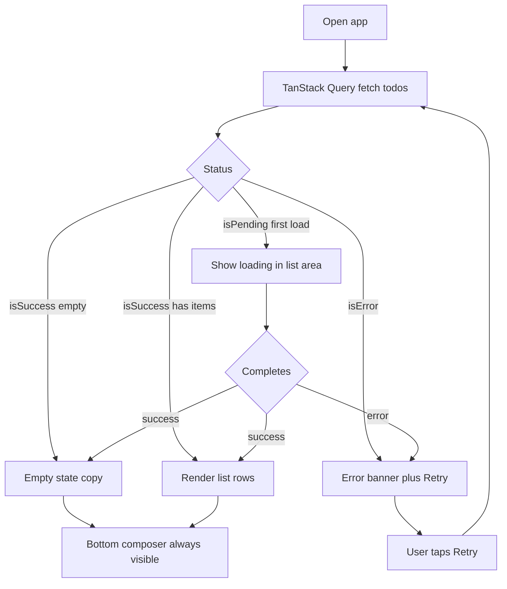
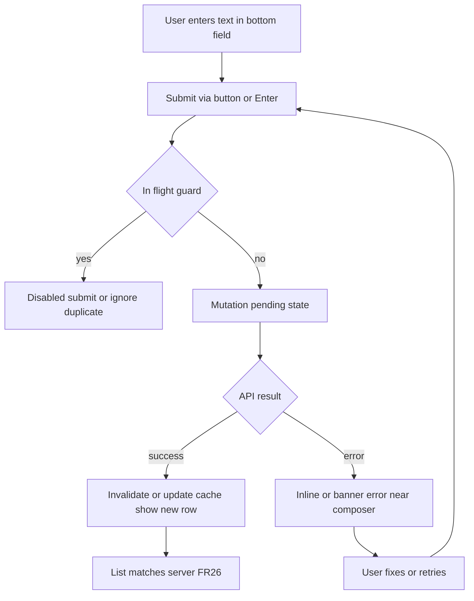
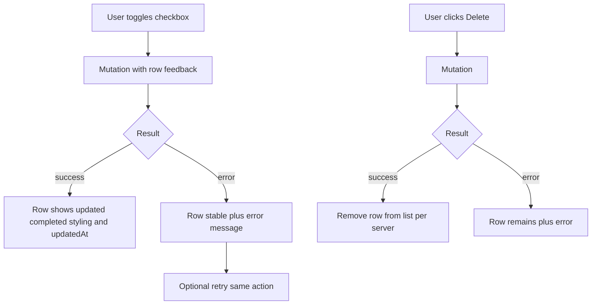
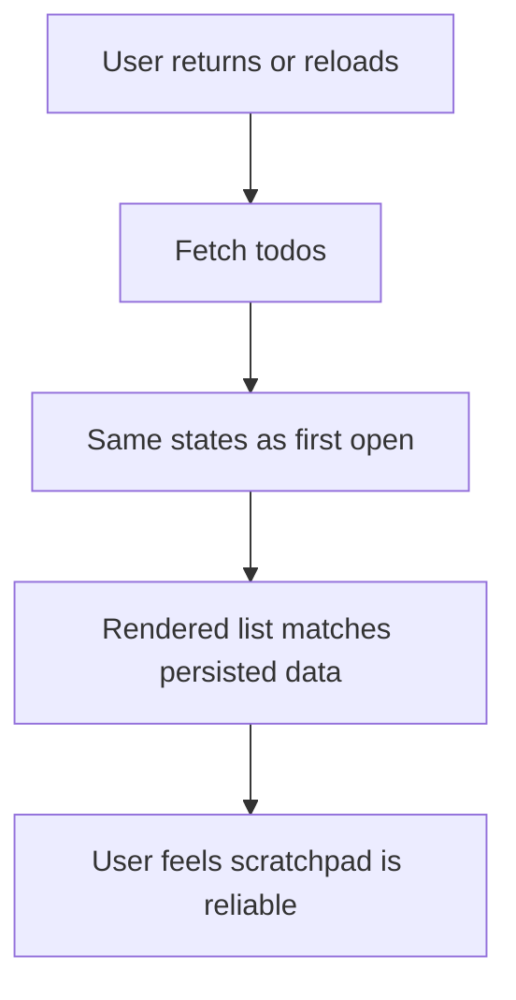

---
stepsCompleted:
  - 1
  - 2
  - 3
  - 4
  - 5
  - 6
  - 7
  - 8
  - 9
  - 10
  - 11
  - 12
  - 13
  - 14
uxWorkflowStatus: complete
lastStep: 14
completedAt: "2026-04-08"
inputDocuments:
  - _bmad-output/planning-artifacts/prd.md
  - _bmad-output/planning-artifacts/architecture.md
---

# UX Design Specification bmad-todo-app

**Author:** Michael
**Date:** April 8, 2026

---

<!-- UX design content will be appended sequentially through collaborative workflow steps -->

## Executive Summary

### Project Vision

**bmad-todo-app** is a minimal full-stack web experience for one person managing a single, trustworthy task list. The product wins through **clarity and restraint**: few moving parts, predictable behavior, and polish where small apps often fail—responsive layout from phone to desktop, immediate feedback on core actions, and **honest** empty, loading, and error states. The server is the source of truth; the UI may feel instant (e.g. optimistic updates) but must **reconcile** with the API so users never lose trust after refresh or retry. V1 deliberately excludes accounts, collaboration, and advanced task features so the core loop feels **finished**, not like a scaffold.

### Target Users

- **Alex (primary):** Uses the app as a mental scratchpad between meetings or on the go. Needs the list **on open** with no tour, fast add / complete / delete, obvious active vs done styling, and the same data after reload. Frustrated by vague spinners, silent failures, and duplicate items from flaky networks.
- **Jordan (developer / operator):** Runs and deploys the app, debugs issues via logs and health endpoints. Needs a clear API and UI error story that does not require an admin console in v1.
- **Assumptions from PRD:** Intermediate web literacy; primary surfaces are **current desktop and mobile browsers** (Chrome, Firefox, Safari, Edge, including iOS Safari and Chrome Android). Keyboard-only use of core flows is a baseline expectation.

### Key Design Challenges

- **Truth under stress:** Balancing perceived speed (mutations that feel immediate) with **server authority**—pending states, errors, retry, and reconciliation must not create ghost items, wrong counts, or “I thought I deleted that” moments after refresh.
- **State honesty:** Distinct, recoverable **empty**, **loading**, and **error** patterns for initial load and for create/update/delete failures, with messaging that stays safe for end users while remaining actionable (retry, check connection).
- **Touch and pointer parity:** One-screen todo experience that stays usable on narrow viewports—tap targets, readability, no accidental double-submit leading to duplicate todos (architecture: guard via disabled controls or de-duplication patterns aligned with TanStack Query).
- **Accessibility without a WCAG program:** Keyboard completion of add / complete / delete, visible focus, and semantic structure for the list and controls—enough for baseline assistive tech support without treating a full audit as v1 gate.

### Design Opportunities

- **“No cognitive tax” list:** Instant recognition of done vs active, creation time as quiet metadata, and an empty state that feels inviting rather than broken—differentiation through calm, professional polish rather than feature count.
- **Trust-building error UX:** A small, consistent mapping from API error codes to human language (per architecture) turns failure paths into confidence builders when retry succeeds and the list matches the server.
- **Single-surface focus:** No routing complexity in v1 enables obsessive attention to one screen’s rhythm—add field, list, feedback strip or inline states—aligned with the architecture’s single-route SPA choice.

## Core User Experience

### Defining Experience

The defining loop is **see list → add or adjust tasks → trust what you see**. The most frequent actions are **adding a short todo**, **toggling completion**, and **deleting**—each should feel immediate under normal conditions while staying aligned with the **authoritative API** (TanStack Query on the client). The product is **not** onboarding-driven: first paint should land the user in the todo surface with appropriate **loading** feedback, not a blank or ambiguous wait.

### Platform Strategy

**Responsive web** in the browser: one primary view (single-route SPA per architecture), optimized from **narrow (phone)** to **wide (desktop)** with touch-friendly targets and keyboard-complete core flows. **No offline or native-app requirement** for v1; **no WebSockets**. Environment-based API base URL and CORS are implementation constraints that affect how errors and latency show up in the UI, not separate “platforms” for the user.

### Effortless Interactions

- **Opening the app** and immediately understanding whether the list is loading, empty, or populated.
- **Adding a todo** with minimal friction (short text, clear submit/add control, no duplicate ghosts from double tap or slow network).
- **Scanning the list** and knowing what’s done vs active without reading carefully.
- **Recovering from failure** with plain language and **retry** where it makes sense, without exposing internal stack traces.

### Critical Success Moments

- **First return visit / reload:** The same items and states appear—this is the “reliable scratchpad” payoff.
- **After a failed mutation or load:** User retries (or connection improves) and the UI **matches server truth** with no lingering incorrect rows.
- **Mobile switch:** Core actions remain comfortable on a small screen without horizontal scroll on primary flows.

### Experience Principles

1. **Clarity over cleverness** — predictable layout and labels; avoid novelty that hides state.
2. **Honest feedback** — every async path shows loading, success, or actionable error; no silent failure.
3. **Server-aligned truth** — fast UI is allowed; confusion after refresh is not.
4. **One-screen focus** — depth comes from polish and accessibility, not from more routes or modes in v1.
5. **Respect the thumb and the keyboard** — touch and keyboard paths are first-class for the core loop.

## Desired Emotional Response

### Primary Emotional Goals

Users should feel **calm, focused, and in control**—like the app is a quiet surface that holds their mental load without asking for attention. The standout feeling is **relief through reliability**: “I don’t have to fight this.” A secondary feeling is **quiet competence** after completing the core loop (add, check off, delete) without instructions. The product should **not** feel clever, busy, or “demo-ish”; it should feel **settled and finished**.

### Emotional Journey Mapping

- **First open:** Reassurance—something is clearly happening (loading) or the list is visibly empty or populated; no “is this broken?” void.
- **During core use:** Light, steady momentum—tasks appear and update without drama; active vs done reads instantly.
- **After closing the loop:** Subtle accomplishment and **mental clearance**; optional micro-satisfaction when items are checked off, without gamification noise.
- **When something fails:** **Grounded, not panicked**—clear wording, a path to retry, no shame; users should feel the product is **on their side** even when the network or server misbehaves.
- **On return:** **Familiar trust**—“my list is still here” reinforces the scratchpad metaphor from the PRD journeys.

### Micro-Emotions

Priorities for v1: **trust over skepticism**, **confidence over confusion**, **accomplishment over frustration** on the happy path, and **satisfaction** (steady, professional) over **delight** (surprise is optional and small). When errors occur, aim for **determined calm** rather than anxiety—users know what happened and what to try next. Avoid emotions of **abandonment** (silent failure), **humiliation** (blaming copy), or **doubt** (mismatched list after refresh).

### Design Implications

- **Calm / focused** → Restrained visual hierarchy, generous spacing, limited motion; no noisy empty states or aggressive empty “calls to action.”
- **Trust** → Visible loading and error states, consistent copy from a small error-mapping module, reconciliation behavior that matches server truth after retry or refresh.
- **Competence** → Obvious completed styling, readable metadata (e.g. created time) as supporting detail, not clutter.
- **Recovery without panic** → Short, plain-language messages; retry affordances; avoid technical jargon in the UI (operators get detail in logs per architecture).

### Emotional Design Principles

1. **Emotional temperature: cool** — prioritize clarity and restfulness over excitement.
2. **Trust is a feature** — especially under failure; honesty beats fake speed.
3. **No emotional debt** — don’t borrow delight from future scope; earn calm from current behavior.
4. **Respect cognitive load** — one primary story per screen state (empty, loading, list, error).
5. **Dignity in errors** — never make the user feel foolish for connectivity or server issues.

## UX Pattern Analysis & Inspiration

### Inspiring Products Analysis

**Apple Reminders / system todo patterns** — Strength is **instant familiarity**: checklist mental model, clear completion affordance, minimal chrome. Navigation is effectively **one list**; onboarding is absent because the metaphor is universal. Relevant lesson: **default to native-list semantics** (structure, focus order) even on the web.

**Microsoft To Do / Google Tasks (lightweight web)** — Strength is **fast capture**: prominent add affordance, list-first layout, mobile-friendly tap targets. They live with **sync truth** under the hood; users feel “it’s just there.” Relevant lesson: **optimize the add → appear loop** and keep secondary metadata visually quiet.

**Things (Cultured Code)** — Strength is **calm density** and **visual rest**: typography and spacing do the hierarchy work without shouting. Relevant lesson: **polish through restraint**—our differentiation matches this more than “feature-rich” todo apps.

**Cross-cutting:** Products users return to in this category win on **predictability** and **honest busy/empty states**, not on novelty.

### Transferable UX Patterns

**Navigation / hierarchy**

- **Single primary surface** — one column, list as hero; matches architecture’s single-route SPA and PRD FR1.
- **Persistent add entry** — input + primary action always reachable; **bottom-anchored composer** (Design Direction 9) on narrow and wide viewports for consistent thumb and focus order.

**Interaction**

- **Checkbox or toggle for completion** — universal metaphor; pair with **striking but readable** completed styling (not low-contrast illegibility).
- **Explicit delete** — per-row control or consolidated action pattern; avoid “only undo” as the only escape (reduces anxiety for mistaken adds).
- **Mutation feedback** — disable submit while in-flight or show row-level pending; supports FR13 and architecture’s double-submit guidance.
- **Recoverable errors** — inline or summary error with **Retry** for loads; for mutations, keep list stable and message actionable.

**Visual / content**

- **Quiet metadata** — created time as secondary text; supports FR7 without clutter.
- **State-specific panels** — empty illustration or copy block that reads **intentional**, not “404 for feelings.”

### Anti-Patterns to Avoid

- **Mystery meat loading** — long blank regions with no skeleton or text; fights NFR-P2 and emotional “abandonment.”
- **Silent sync failure** — list looks fine but is wrong after refresh; breaks trust and FR26.
- **Duplicate ghosts from double tap** — undermines “reliable scratchpad” and PRD edge journey.
- **Tutorial walls or feature tours** — violates FR1 and the “no cognitive tax” vision.
- **Gamification noise** — streaks, points, celebratory confetti; clashes with calm emotional goals.
- **Over-compressed mobile layout** — tiny touch targets or horizontal scroll on core flows; breaks FR15–FR16.

### Design Inspiration Strategy

**Adopt**

- **List-first, single-surface hierarchy** — aligns with core experience and architecture.
- **System-familiar completion + delete patterns** — reduces learning curve for Alex.
- **Honest state machine UX** — empty / loading / error / populated as first-class designs, not afterthoughts.

**Adapt**

- **“Instant” feel** — use optimistic UI only if reconciliation rules are spelled out (per PRD); otherwise prefer fast pending states that still feel respectful.
- **Density** — borrow Things-like calm without custom fonts or platform-only components; stay within chosen design system (next step).

**Avoid**

- **Multi-project navigation, tags, or filters in v1** — scope creep vs PRD.
- **Marketing-style empty states** — keep copy short and practical; emotional goal is calm, not hype.
- **Technical error leakage** — stack traces or raw JSON in the UI; conflicts with NFR-S3 and emotional dignity.

## Design System Foundation

### 1.1 Design System Choice

**Tailwind CSS** as the primary styling system for the **Vite + React + TypeScript** client, composed with **accessible, headless primitives** where they reduce risk (e.g. **Radix UI** patterns, or **shadcn/ui**-style copy-in components built on Radix + Tailwind—implementation can pick one concrete path in the first UI story).

**Not chosen for v1:** A full heavy kit such as **MUI** or **Ant Design** as the default shell—strong for dense apps, but heavier visually and bundle-wise than this product’s “calm restraint” bar warrants.

### Rationale for Selection

- **Aligns with architecture** — Starter evaluation explicitly allows adding **Tailwind** after Vite scaffold; keeps client boundaries clean and team velocity high.
- **Speed + consistency** — Utility tokens and shared spacing/typography scales make empty/loading/error/list states feel like one family without a bespoke CSS architecture.
- **Brand flexibility** — A **dark, professional** visual direction is expressed through **theme tokens** (surfaces, borders, text, accents) rather than fighting a pre-baked light-only kit.
- **Accessibility baseline** — Pair Tailwind layout with **semantic HTML** (lists, labels, focus-visible rings) and headless components for tricky controls if needed; meets PRD keyboard/focus expectations and supports **contrast-conscious** state styling.

### Implementation Approach

1. Add **Tailwind** to `client/` per Vite docs; configure **content paths** for `src/**`.
2. Define a **dark-first token layer** in `tailwind.config`: layered neutrals for **page, panel, and row** surfaces; **primary text**, **secondary/metadata text**, and **muted** lines for completed items (must stay readable—see below). Include a single **primary action** accent and distinct **error** / **warning** (if needed) hues that work on dark backgrounds.
3. Build **TodoApp** surfaces with **plain components** first (`TodoList`, `TodoItem`, `AddTodoForm`); introduce Radix/shadcn only where native elements are insufficient—avoid importing a whole kitchen sink on day one.
4. Keep **motion minimal**—transition durations for hover/focus only; no decorative animation requirements.

### Color & theme (stakeholder direction)

- **Default to a dark UI** that reads as **professional** and **easy on the eyes** for longer sessions: prefer **deep neutrals** (e.g. slate/zinc-style ramps) with **subtle separation** between surface levels—not harsh full black with pure white text unless contrast testing supports it everywhere.
- **State must pop clearly:** **active** vs **completed** todos, **loading**, **error**, **focus**, and **primary actions** each need **intentional contrast** (luminance and/or hue) so users never have to guess system state. Completed styling stays **obviously different** but **does not collapse into illegible gray** (FR8, NFR-A).
- **Validate critical pairs** (body text, labels, buttons, error text, focus rings) against **WCAG contrast** guidance as a **baseline** during implementation, consistent with the PRD’s accessibility posture.

### Customization Strategy

- **Visual personality:** Restrained typography (system UI stack or one optional webfont later), generous vertical rhythm; **completed** items use **strikethrough + stepped-down foreground** on dark surfaces while keeping metadata scannable.
- **Density:** Mobile-first spacing (44px-ish touch targets) scaled up subtly on desktop.
- **Errors:** Dedicated utility classes or small components for **inline alert** and **banner** patterns on dark surfaces—sufficient **hue + luminance separation** from the page background so recovery copy and **Retry** feel actionable, not decorative.
- **Future:** If brand guidelines arrive post-v1, update Tailwind theme extension rather than replacing component architecture; a light theme could be added later without changing interaction patterns.

## 2. Core User Experience

### 2.1 Defining Experience

The defining experience users will describe in one breath: **“I open it, my list is there, I add or check things off, and it stays true.”** The product is not “smart todo AI”—it is **a dependable single list** that respects **server truth** while still feeling **responsive**. If that loop is flawless, everything else in v1 is ornament.

### 2.2 User Mental Model

Users bring a **paper checklist / Reminders** mental model: one place, linear order, **done means visually done**, delete means gone. They expect **no account friction** in v1 and assume **refresh = reality**. Confusion appears when **the UI lies** (optimistic ghosts, duplicates, or missing items after reload), when **loading feels infinite**, or when **errors blame the user** instead of offering retry.

### 2.3 Success Criteria

- **Immediate orientation:** Within a second or two of the todo region appearing, the user knows if the app is **loading**, **empty**, **ready**, or **failed**—on the **dark** surface, states remain **high-contrast** and unambiguous.
- **Frictionless capture:** Add short text → item appears (or clear pending/error)—**no duplicate** from double submit.
- **Scannable truth:** Active vs completed is **obvious**; metadata is secondary but readable.
- **Recovery:** Failed load or mutation yields **plain language + retry**; after success, list **matches** API (FR26).
- **Cross-session trust:** Reload or return later → **same** items and completion states for that deployment.

### 2.4 Novel UX Patterns

**Established patterns dominate**—checkbox/toggle complete, text field + submit, per-row delete, list semantics. **No novel gesture or paradigm** and **no onboarding** (FR1). The “twist” is **execution quality** under the **dark professional** visual system: **clarity of state** and **honest async behavior**, not a new interaction language.

### 2.5 Experience Mechanics

**1. Initiation** — User lands on the app; the **todo surface** is primary. No mandatory tour. **Composer is at the bottom** of the panel; optional: autofocus the add field on desktop if it does not conflict with assistive tech—**focus order** should follow title → list → add row.

**2. Interaction** — User **types** a short description and **submits** (button or Enter); user **toggles** completion; user **deletes** with an explicit control. Controls show **visible focus** on the dark theme; primary action uses the **accent** token.

**3. Feedback** — **Loading:** skeleton or text + non-blinding indicator on dark ground. **Success:** list updates; row may show brief pending then settled state if using optimistic flows. **Error:** message + **Retry**; row-level or banner per pattern chosen in implementation. **Completed:** distinct **foreground/step + optional strikethrough** without washing out.

**4. Completion** — User considers a task “done” when it **looks done** and stays done after refresh. Session ends with **mental clearance**—the app feels like a **quiet tool**, not a conversation.

## Visual Design Foundation

### Color System

**Baseline:** **Dark-first** UI using **layered neutrals** (e.g. zinc/slate-style ramps in Tailwind): **page** (deepest), **panel** (todo card / content well), **row** (optional hover/selected elevation), **border/subtle dividers**. Avoid **pure #000** page + **pure #FFF** body text unless pairing is verified; slightly lifted surfaces reduce eye strain and support depth.

**Semantic mapping:**

- **Text:** `primary` (titles, todo text), `secondary` (hints, labels), `muted` (completed todo text—**still readable**, not near-background merge).
- **Accent:** **Teal** primary for Add / primary buttons and checkbox accent—reference **`#2dd4bf`** (Design Direction 9); must pass contrast on **filled** buttons and work for **focus ring** pairing where used.
- **State:** **Error** (load/mutation failure banners, inline alerts)—distinct hue + enough luminance vs page; **success** optional and subtle if used at all (v1 may rely on list update vs toasts). **Loading** indicators use **muted accent** or **neutral** motion, not flashing high-chrome white.
- **Completed todos:** Lower-emphasis foreground **plus** strikethrough; **separate token** from disabled UI so it never reads as “unavailable control.”

**Process:** Implement tokens in `tailwind.config` theme extension (`colors`); document **semantic names** in code (e.g. `surface.page`, `text.primary`) via CSS variables or Tailwind `@apply` patterns so raw hex isn’t scattered.

### Typography System

**Tone:** **Professional, calm, product-ui**—not marketing display type.

**Faces:** **System UI stack** first (`system-ui`, `Segoe UI`, `Roboto`, `Helvetica Neue`, `Arial`, sans-serif) for zero load and native feel on dark surfaces. **Optional later:** one variable or static webfont for **title only** if brand emerges—defer until needed.

**Scale (suggested):** One **page title** (e.g. `text-xl`–`text-2xl`, `font-semibold`), **body** for todo text (`text-base`, comfortable `leading-relaxed`), **small** for timestamps/metadata (`text-sm`, `text-muted`). **Line length:** constrain content **max-width** (e.g. `max-w-xl`–`max-w-2xl`) on large screens for scanability.

**Hierarchy:** Todos are **one dominant text style**; avoid multiple heading levels in v1 (single surface).

### Spacing & Layout Foundation

**Unit:** **4px base grid** (Tailwind default scale); favor **8px multiples** for section gaps (`p-4`, `p-6`, `gap-4`).

**Feel:** **Airy but efficient**—calm whitespace consistent with Things-like inspiration; list rows **min-height** comfortable for touch (~44px+).

**Layout:** **Single column** centered or left-aligned in a **max-width** container; **full bleed** on very narrow viewports with consistent horizontal padding (`px-4`). **Add form** is **bottom-anchored** within the todo panel (per **Design Direction 9**): list region above, composer below with a clear separator—thumb-friendly on mobile; document any sticky/fixed viewport behavior in the first UI story.

**Grid:** No complex grid; optional **12-column** only if future layouts demand it—**not v1**.

### Accessibility Considerations

- **Contrast:** Check **body**, **muted/completed**, **buttons**, **error text**, **links in errors**, and **focus rings** against WCAG **AA** targets for normal text and UI components where applicable (PRD baseline; full audit post-v1).
- **Focus:** Always **visible** on dark backgrounds (`focus-visible` ring using accent or high-contrast neutral); order matches visual reading order (FR16, NFR-A1).
- **Semantics:** **`<ul>` / `<li>`** or equivalent list semantics; checkboxes **associated with labels**; buttons **named** (Add, Delete, Retry).
- **Motion:** Respect **`prefers-reduced-motion`** for any transitions or spinners.

## Design Direction Decision

### Design Directions Explored

Static mockups live in **`_bmad-output/planning-artifacts/ux-design-directions.html`** (nine directions): centered layouts with blue or teal or violet accents, compact density, **bottom-composer** layout, inset card, empty state, load error + retry, and **Direction 9** (bottom composer + teal palette).

### Chosen Direction

**Direction 9 — Composer bottom + teal palette**

- **Layout (from Direction 5):** Todo panel uses a **column layout** with the **list above** and the **add row anchored at the bottom**, separated by a **top border** on the composer so capture stays visually and ergonomically distinct—optimized for **thumb reach** on narrow viewports while staying a single-surface app.
- **Color (from Direction 2):** **Teal accent** reference **`#2dd4bf`** on **slate-style panel** reference **`#1a1f2e`** (map to Tailwind semantic tokens in implementation).
- **Anchor in file:** open the HTML explorer and jump to **`#dir-9`**.

### Design Rationale

- **Stakeholder choice:** Combines the **bottom composer** pattern with the **teal** professional palette for a calmer, slightly cooler feel than default blue while keeping **state-forward contrast** on dark surfaces.
- **Fits core experience:** Supports scan → act → trust without extra navigation; aligns with PRD **FR1** (no mandatory onboarding) and mobile/desktop usability **FR15**.
- **Composable with other mockups:** **Empty** (Direction 7) and **error + Retry** (Direction 8) patterns still define those states inside this chrome.

### Implementation Approach

- Configure Tailwind (or CSS variables) so **primary/accent** maps to the chosen teal and **surfaces** to layered dark neutrals consistent with the mockup.
- Implement **`TodoApp`** as **flex column**: title → **scrollable list** (`flex-1`, `min-h-0` as needed) → **composer footer** inside the panel; confirm **sticky vs in-flow** bottom bar for small viewports in the first UI story.
- Reuse the **error banner** and **empty** treatments from Directions 7–8 visually, adapted to **teal** focus rings and primary buttons.
- Treat **`ux-design-directions.html`** as a **design reference artifact** only (not part of the production bundle).

## User Journey Flows

Flows build on PRD journeys (**Alex** happy path and failure path, **Jordan** operator, **Sam** SPA/API alignment). **Direction 9** UI: list above, **bottom composer**, **teal** accent, dark surfaces.

### Journey: Open app and load list

User lands with **no onboarding**. The todo region immediately reflects **loading**, **empty**, **populated**, or **error**.

### Journey: Add todo from bottom composer

Aligns with **FR2**, **FR13**, **NFR-P1**—clear acknowledgment, no duplicate ghosts.

### Journey: Toggle complete and delete

### Journey: Return visit and trust

### Journey Patterns

- **Single surface:** No route changes; all states are **swaps inside** the todo panel + bottom composer.
- **Server truth:** After any successful refetch, **UI equals API** (FR26).
- **Recovery:** **Retry** for failed **queries**; mutations show **actionable** errors without raw traces.
- **Progressive feedback:** **Loading** never silent; **pending** on mutations where helpful.

### Flow Optimization Principles

- **Minimize steps to value:** One field + Add for capture; checkbox for done; one tap Delete.
- **Cognitive load:** One primary story per state; no modals required for v1 core loop.
- **Double-submit:** Guard at control + Query mutation discipline (architecture).
- **Calm errors:** Short copy, **Retry** when safe, **dignified** tone (emotional spec).

## Component Strategy

### Design System Components

**Tailwind CSS** supplies layout, spacing, typography, color tokens, borders, focus rings, and responsive utilities. Optional **Radix / shadcn-style** primitives only if native HTML is insufficient.

**Typical built-ins:** `button`, `input`, `label`, `ul`/`li`, checkbox patterns, semantic headings.

### Custom Components

Composite components map cleanly to architecture’s `client/src/todos/` layout.

#### TodoApp

- **Purpose:** Shell for title, scrollable list region, and **bottom composer** (Direction 9).
- **States:** loading | empty | list | error (query).
- **Accessibility:** Landmark or heading for page title; list in scrollable region with `min-h-0` flex pattern.

#### TodoList

- **Purpose:** Renders collection; handles **empty** vs **rows**.
- **States:** populated, empty (slot or child), loading skeleton optional.

#### TodoItem

- **Purpose:** One row: **checkbox** + text + metadata + **Delete**.
- **States:** active, completed (strikethrough + muted **readable** text), mutation pending optional.
- **Accessibility:** Checkbox **labeled** by todo text (`aria-labelledby` or wrapping `label`); Delete has **accessible name**.

#### AddTodoForm (bottom composer)

- **Purpose:** Text field + **Add**; **Enter** submits.
- **States:** idle, submitting (disabled), error (message).
- **Accessibility:** `label` for input; submit disabled during flight for FR13.

#### QueryErrorBanner (or inline)

- **Purpose:** Load failures with **Retry** (Direction 8 pattern); **teal** Retry button on dark error surface.
- **States:** visible / dismissed after success.

#### LoadingSkeleton (optional)

- **Purpose:** NFR-P2 immediate feedback—few placeholder rows or text “Loading todos…”

### Component Implementation Strategy

- Implement with **Tailwind tokens** only until a primitive is justified.
- Share **error copy mapping** module (`mapApiError`) for consistent user strings (architecture).
- **No duplicate** server-state store outside TanStack Query.

### Implementation Roadmap

**Phase 1 — MVP shell:** `TodoApp`, `AddTodoForm`, `TodoList`, `TodoItem`, query error + loading + empty.

**Phase 2 — Polish:** skeleton refinement, row-level mutation errors, `prefers-reduced-motion`.

**Phase 3 — Optional:** extract shared `Button`/`Input` wrappers if duplication hurts.

## UX Consistency Patterns

### Button Hierarchy

- **Primary:** **Add** (and **Retry** on error banners)—filled **teal** token, dark text on button per contrast check.
- **Secondary / destructive:** **Delete**—**ghost** or subtle outline on dark surface, **visible focus** ring; never same weight as Add unless confirming delete (v1 no confirm modal unless added later).
- **Disabled:** During in-flight mutation, primary **disabled** with clear visual (opacity + `cursor-not-allowed`).

### Feedback Patterns

- **Loading (query):** Occupies **list region** immediately—skeleton or text; not a blank panel.
- **Loading (mutation):** Row-level spinner optional; **disable** Add submit at minimum.
- **Error:** **Banner** for failed list load; **inline or banner** for failed add/toggle/delete—always **plain language** + **Retry** where idempotent/reasonable (per architecture: cautious auto-retry on POST).
- **Success:** Implicit list update; avoid noisy toasts for v1 (calm emotional goal).

### Form Patterns

- **Single field** v1; **client hint** validation (max length mirror server) optional; **server authoritative** (FR22).
- **Enter** submits Add when field focused.

### Navigation Patterns

- **None** for v1 beyond single view; focus order: **title → list → composer**.

### Additional Patterns

- **Empty state:** Short headline + one line guidance; **composer** still visible (Direction 7 tone).
- **Completed items:** Strikethrough + **muted** color token—not **disabled** control styling.
- **Metadata:** `createdAt` / `updatedAt` as **small secondary** line under text.

## Responsive Design & Accessibility

### Responsive Strategy

- **Mobile-first:** **Full-width** panel with horizontal padding; **bottom composer** supports thumb reach; list **scrolls** between title and composer (`flex-1` + `overflow-auto`).
- **Tablet / desktop:** **Max-width** column centered (or slightly left-aligned if preferred); **same** component tree—more whitespace, not new features.
- **No** hamburger, **no** bottom nav—single screen.

### Breakpoint Strategy

- Use **Tailwind defaults** (`sm` 640px, `md` 768px, `lg` 1024px) for padding and **max-width** tweaks only.
- **Touch targets:** Minimum **~44px** height on row actions and Add on smallest width.

### Accessibility Strategy

- **Target:** **WCAG 2.1 AA** for **core flows** where feasible—contrast for text, UI components, and **focus** on dark theme (PRD baseline; full audit post-v1).
- **Keyboard:** **Tab** through title region, list items (checkbox + delete per row), composer; **Enter** on Add; **Space** toggles checkbox.
- **Screen readers:** Semantic **list**; **labels** on inputs and icon-only buttons; **live region** optional for errors if banner alone is insufficient—prefer **visible** banner first.
- **Motion:** Honor **`prefers-reduced-motion`** for spinners/transitions.

### Testing Strategy

- **Automated:** **Playwright** E2E per architecture (create, complete, delete, empty, error paths).
- **Manual:** Keyboard-only pass on Chrome + Safari; spot-check **VoiceOver** (macOS/iOS) or **NVDA** on Windows for list + form.
- **Visual:** Resize **320px → wide**; verify composer **never** obscures list without scroll.

### Implementation Guidelines

- Prefer **rem** / Tailwind spacing scale; **semantic HTML** first; **focus-visible** rings **high contrast** vs page.
- Map API errors through **one client module**; never `alert()` raw errors.
- Document **color tokens** and **focus** behavior in `README` or Storybook later if adopted.
